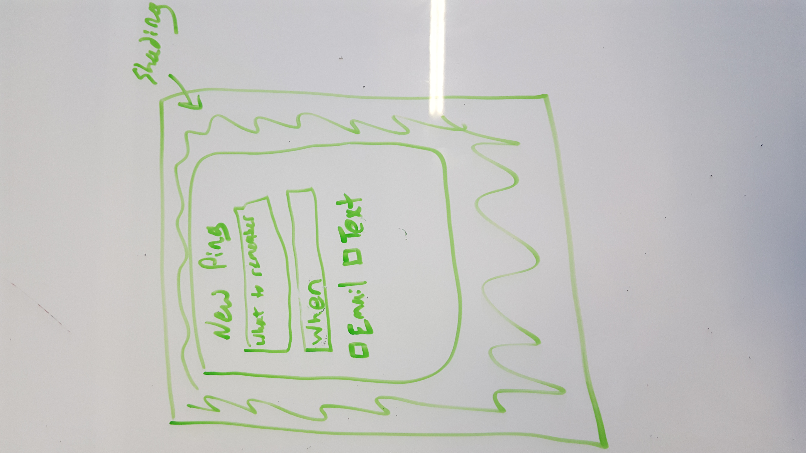
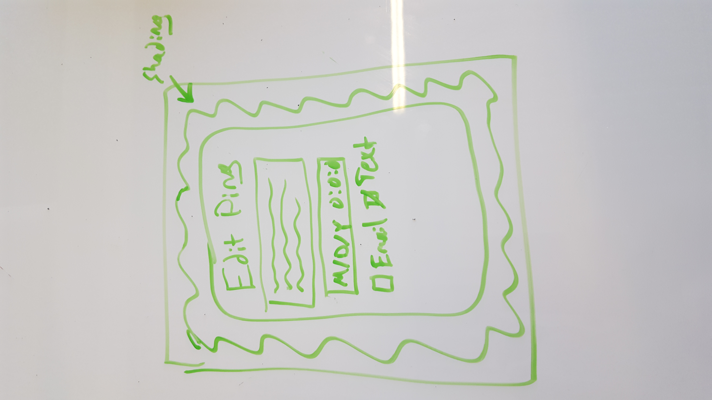
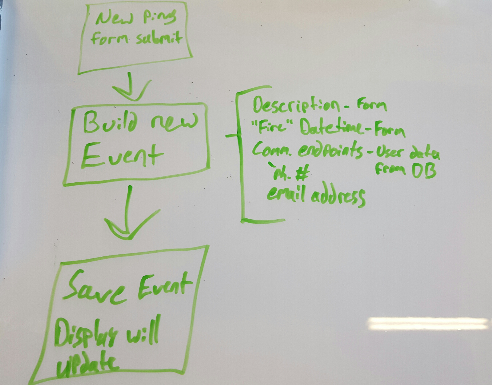
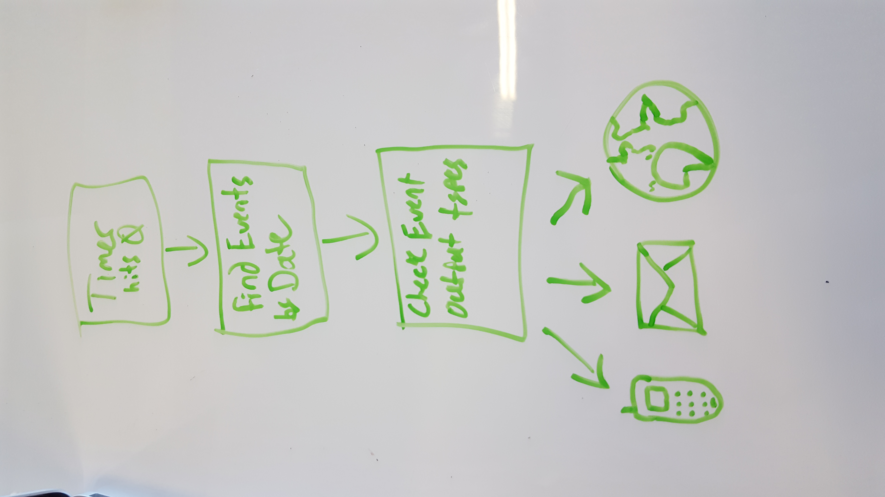

App that goes “Ping”
============================
Nathaniel Biessener
-------------------
10/02/16 | Version 1

Application Overview
--------------------
Machine App that goes “Ping” is a full-stack web application that will send reminders to you through as many channels as possible. MVP goal is to send either SMS or email reminders that were requested through an input form. Users will only be able to view their own ‘pings’. Stretch goals include additional reminder channels (Slack, physical mailbox, phone calls) and a prettier input form.

Application Features
--------------------
Landing page will only have a sign-in

Sign in via Auth0

Pings View
* List of all pending pings for logged in user
* Pings will self-destruct upon “firing”
* Buttons to edit or delete pings
* Button to add ping


New Ping Form
* What should you not forget?
* When should you not forget it?
* In what manner would you like to be reminded?

Edit Ping Form
Essentially the new ping form, but fields are pre-filled with previously entered data

Email Reminder
Email: “Don’t forget to do the thing you asked me to tell you not to forget to do: <thing>”

SMS Reminder
Text Message: “Don’t forget to do the thing you asked me to tell you not to forget to do: <thing>”

User Contact Information View
For each possible endpoint, ability to add/edit appropriate contact information

Server & Database
Ping information will be created and stored on form submission.


Server will check at a set interval for events with timestamps “less than” the current time, then for each matching event send pings via that event’s stored output types. Nodemailer will send email, Twilio likely will be used for SMS. Future ping types TBD.

Event data:
* Description - String
* Ping Time - Date (input will be controlled by the form)
* Object with property names corresponding to each output type, each property will contain recipient information relevant to that output type. Ex. {“email”: address@service.com, “smsPhoneNumber”: 6519999999}

User data:
* Name - String
* Email address - String (input controlled by the form)
* Phone number - String (input controlled by the form)
* Events - Event documents created by that user

Project Milestones and Schedule
-------------------------------

* Proof of concept project to send communication by email via Nodemailer.  -  10-3-2016
* Front end shell  -  10-4-2016
* Server side timer running  -  10-5-2016
* Email reminders  -  10-6-2016
* SMS reminders (Twilio?)  -  10-10-2016
* Deploy to Heroku  -  10-11-2016
* Slack reminders  -  10-13-2016
* Polished front end and reminders  -  10-14-2016
* Ping “snooze” feature  -  Stretch
* Send a ping to another user (other user can accept/decline)  -  Stretch
* Validate user endpoints (confirmation email/text)  -  Stretch
* Physical mailbox reminders  -  Someday

Browsers
--------
Application will fully support browsers listed below. All browsers or versions not listed below are considered out of scope.

Browser Name
Version
Chrome
 52.0.2743.82 (64-bit)

Assumptions
-----------
While completing this estimate the following assumptions were made.
* Nodemailer will work as intended
* Twilio will work as intended
* Other technologies are available to send communication from Node

Technologies
------------
* MongoDB
* Express
* Angular
* Node
* Auth0
* Heroku
* Nodemailer
* Twilio
* TBD technologies to hit other communication endpoints
